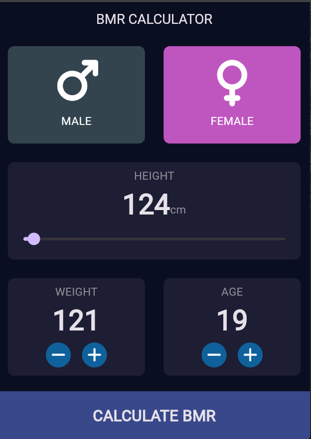
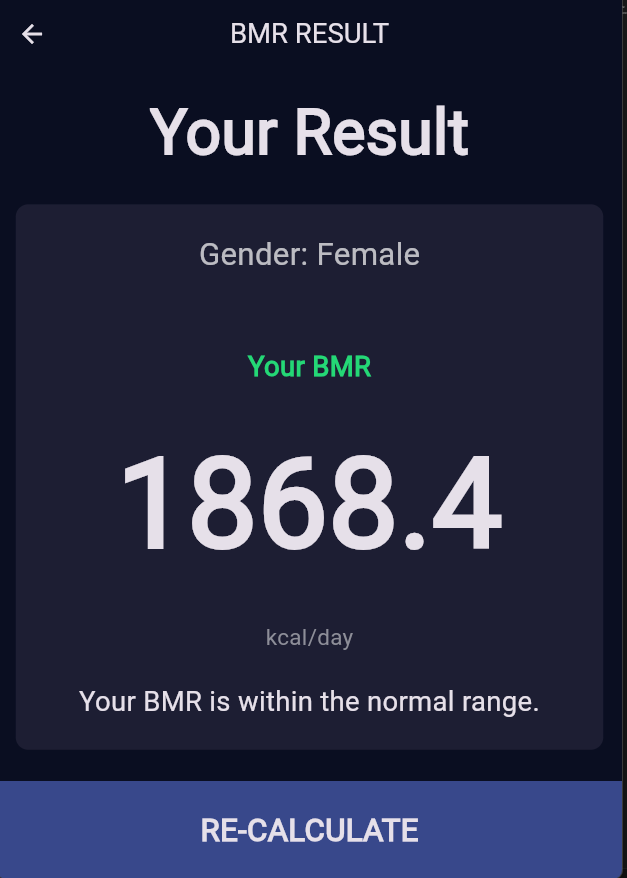

# BMR Calculator App

## 👥 Anggota Kelompok
- Nizma Nabila Shafa Susilo (K3523058)
- Muhammad Rizal Alfarisyi (K3523050)

## 📱 Deskripsi
Aplikasi ini merupakan **kalkulator BMR (Basal Metabolic Rate)** berbasis **Flutter**.  
BMR menunjukkan jumlah energi (kalori) yang dibutuhkan tubuh untuk mempertahankan fungsi vital saat istirahat.

Fitur:
- Input jenis kelamin (male/female)
- Input tinggi badan, berat badan, dan usia
- Perhitungan otomatis menggunakan rumus Mifflin-St Jeor
- Tampilan hasil dengan deskripsi kondisi metabolisme
- Tema gelap elegan menggunakan `ThemeData.dark()`
- Modularisasi dengan custom widget dan class kalkulator

## 🧮 Rumus
- **Pria:** BMR = 88.362 + (13.397 × berat) + (4.799 × tinggi) - (5.677 × usia)  
- **Wanita:** BMR = 447.593 + (9.247 × berat) + (3.098 × tinggi) - (4.330 × usia)

## 🖼️ Screenshot
### Halaman Input

### Halaman Hasil

## 💡 Teknologi yang digunakan
- Flutter SDK
- Dart
- Font Awesome Flutter Icons
- Custom Widget Components
